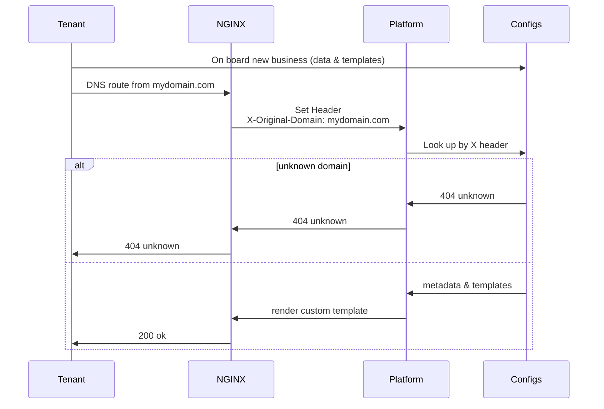

In today's interconnected world, supporting multi-tenancy in a single application environment is a
common challenge for many businesses. This challenge becomes even more complex when each tenant requires
full customization of their templates while maintaining consistency in underlying data structures and
operations. In this guide, we'll explore a straightforward yet powerful approach to address this challenge
using NGINX, Node.js, and Express.

<div class="alert alert-info">
  <h4 class="alert-heading">TL;DR - Just the Code, Please!</h4>
  <p>Don't want to read the post? <a href="https://github.com/guahanweb/custom-http-routing" target="_blank">Here is the example</a> we will be working through.</p>
</div>


## The Problem: Customizable Templates for Multi-Tenancy

Imagine a scenario where you have a single application handling communication preferences such as email
opt-in/out or presenting legal Terms of Service (TOS). While the basic requirements and data mapping
remain consistent across all tenants, each tenant demands unique branding and visualization of these
templates.

## High-Level Architecture

In order to visualize the high-level architecture of our solution, it is illustrated in the sequence
diagram below:




### DNS Mapping to X-Headers in NGINX

We start by leveraging NGINX as a reverse proxy server. Our DNS provider is configured to route requests
to NGINX, which acts as a gateway to our application. NGINX is configured to identify the request domain
and attach it to the request as a custom header (X-Header). This header will be anaylyzed by the platform
to define the tenant context for each request.

```nginx
server {
  listen 80 default_server deferred;
  listen [::]:80 default_server deferred;

  # match the domain and capture in a variable
  server_name ~^(www\.)?(?<domain>.+)$;

  location / {
    # set the x-header using our capture
    proxy_set_header X-Original-Domain $domain;
    proxy_set_header X-Forwarded-For $remote_addr;

    # demo: using a named origin in docker-compose
    proxy_pass http://origin:3000;
  }
}
```

### Reverse Proxy to a Singular Origin Server

In the code sample above, NGINX then forwards these requests to a singular origin server running Node.js
and Express. This server is responsible for handling all incoming requests from different tenants and
serving appropriate responses based on the tenant context.

**NOTE:** if you are following along in the GitHub repo, the named origin server is configured in the
[docker-compose.yml](https://github.com/guahanweb/custom-http-routing/blob/main/scripts/nginx/docker-compose.yml#L14) file. Otherwise, you could use another DNS or IP address for your origin.

### Node.js + Express Server

The Node.js server, powered by Express, receives requests along with tenant information from NGINX. It
processes these requests, interacts with the database or other backend services, and renders dynamic
templates for the respective tenants. For this example, we have created a data mapping with metadata
for the domains we will be testing. In a real-world use case, registration of new tenants should be
handled in an application layer with appropriate validation in place.

```ts
// export a domain mapping for known domains
// this would be configured for your system
function calculateDomainMapping() {
    return {
        'local.microsoft.com': {
            id: 'microsoft',
            name: 'Microsoft',
            baseUri: 'http://local.microsoft.com:3080',
            meta: {},
        },
        'local.amazon.com': {
            id: 'amazon',
            name: 'Amazon',
            baseUri: 'http://local.amazon.com:3080',
            meta: {},
        },
        'local.google.com': {
            id: 'google',
            name: 'Google',
            baseUri: 'http://local.google.com:3080',
            meta: {},
        }
    };
}

export default calculateDomainMapping();
```

Now that we have knowledge of our supported tenants, we can create custom templates to render the shared
content. The `id` from each of the on configured domains will reference the path to the template to be
rendered.

#### Base template: `views/base/index.html`

In this case, the base template is configured to **extend the brand template** in order to give full
flexibility to the tenant. By defining our required Nunjucks blocks and validating the brand templates
are rendering those blocks, we know the core content is displayed.

```njk



  This is my shared content, but I'm being rendered on behalf of <span>{{ name }}</span>!<br>
  (<a href="{{ baseUri }}/test">test link</a>)


```

By rendering this base template and providing a `brandTemplate` variable, this can serve as a consistent
entrypoint for our configured route.

#### Brand specific template: `views/{brand}/index.html`

Each tenant is responsible to create a template for each route they support. Here is an example template
for our `local.microsoft.com` test domain:

```njk
<!doctype html>
<html lang="en">
<head>
</head>
<body>
    <header>
        <h1>Microsoft</h1>
    </header>
    <main>
        <div class="page-content">
        
        </div>
    </main>
</body>
</html>

```

Now, we have created the parent template in the brand context, and we need to be sure to render the
entrypoint template and provide the appropriate `baseTemplate` from which to extend.

#### Configuring the Render Logic

Since we know there is an `X-Header` containing the original domain for our request, we will use
a middleware to parse and attach that value to the request object for use in our route handlers.
We will set up a basic Express server to use this middleware, configure Nunjucks, and render out
domain specific pages:

```ts
// middleware to pull the x-header
const identifyUpstreamDomain = () => (req: Request, res: Response, next: NextFunction) => {
    const original_domain = req.get('x-original-domain');
    res.locals.original_domain = original_domain || 'unknown';
    next();
};

const app = express();

// configure nunjucks
nunjucks.configure('views', {
  autoescape: true,
  express: app,
});

app.set('view engine', 'html');
app.use(identifyUpstreamDomain());

// render our index.html
app.get('/', (req: Request, res: Response, next: NextFunction) => {
  const domain = KNOWN_DOMAINS && KNOWN_DOMAINS[res.locals.origin_domain];

  if (!domain) {
    // unknown domain (tenant) sending traffic
    return res.status(404).send('Not Found');
  }

  res.render('base/index',
    { ...domain, brandTemplate: `${domain.id}/index.html` }, 
    (err: Error, html: string) => {
      if (err) {
        console.error(err);
        res.status(500).send('Unexpected error');
      } else {
        res.send(html);
      }
    });
});
```

Let's break this down and walk through the distinct pieces. First, the middleware we create
will take the `X-Original-Domain` header (appended to the request by NGINX) and attach it
to the `res.locals` object for use by handlers.

```ts
const identifyUpstreamDomain = () => (req: Request, res: Response, next: NextFunction) => {
    const original_domain = req.get('x-original-domain');
    res.locals.original_domain = original_domain || 'unknown';
    next();
};
```

We will skip over the creation of the Express server and configuration of Nunjucks,
since there is nothing additional besides boilerplate code happening there. The next
interesting code is doing a lookup of the domain against our list of known domains
(imported from the registry we created at the very beginning):

```ts
import KNOWN_DOMAINS from './_data/domains';

app.use(identifyUpstreamDomain());
app.get('/', (req: Request, res: Response) => {
  const domain = KNOWN_DOMAINS && KNOWN_DOMAINS[res.locals.original_domain];
  // ...
})
```

If the domain is not recognized, we will return immediately with a 404 error. Otherwise,
we will render our `base/index.html` template, but we provide both metadata and the
calculated `brandTemplate` location for the customized layout:

```ts
res.render('base/index',
  { ...domain, brandTemplate: `${domain.id}/index` },
  (err: Error, html: string) => {
    // ...
  });
```

We need to double-check the error case of the render, since we could still run into missing
templates or other issues. If all goes well, we end up returning the rendered html to
the client:

```ts
res.send(html);
```

### Configuration for Local Testing

To test our setup locally, we need to configure the host file to simulate DNS mapping.
Add the following entries to your host file for this example:

```
127.0.0.1   local.amazon.com
127.0.0.1   local.google.com
127.0.0.1   local.microsoft.com
```

Once this is configured and you have spun up the full stack, you will be able to navigate
to those domains and see the custom templates being rendered.

## Onboarding Process for New Businesses

When onboarding new businesses, follow these steps:

1. **Create Templates:** Develop customizable templates that meet the needs of the new tenant.
2. **Register Business in Mapping:** Add the new business to the registry, ensuring proper route regognition based on the tenant's domain or ID.
3. **Point DNS at NGINX:** Instruct the new business to point their DNS records to your NGINX server.

By following this process, new businesses can seamlessly integrate into your multi-tenant
environment while enjoying full customization capabilities.

In conclusion, supporting multi-tenancy with customizable templates in a single application
environment is achievable with the right architecture and tools. By leveraging NGINX, Node.js,
Express, and Nunjucks, businesses can efficiently manage diverse tenant requirements while
maintaining a robust and scalable application infrastructure.

So, are you ready to empower your application with easy multi-tenancy? Let's get started!
